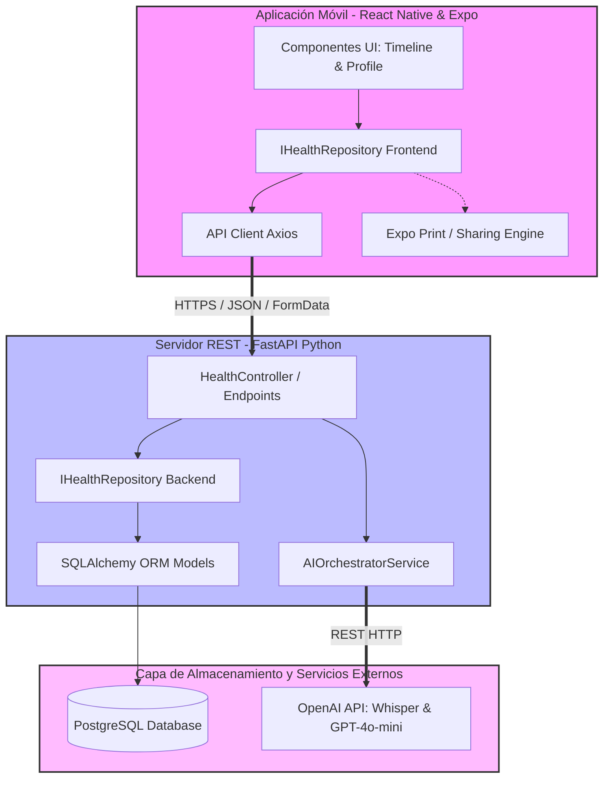
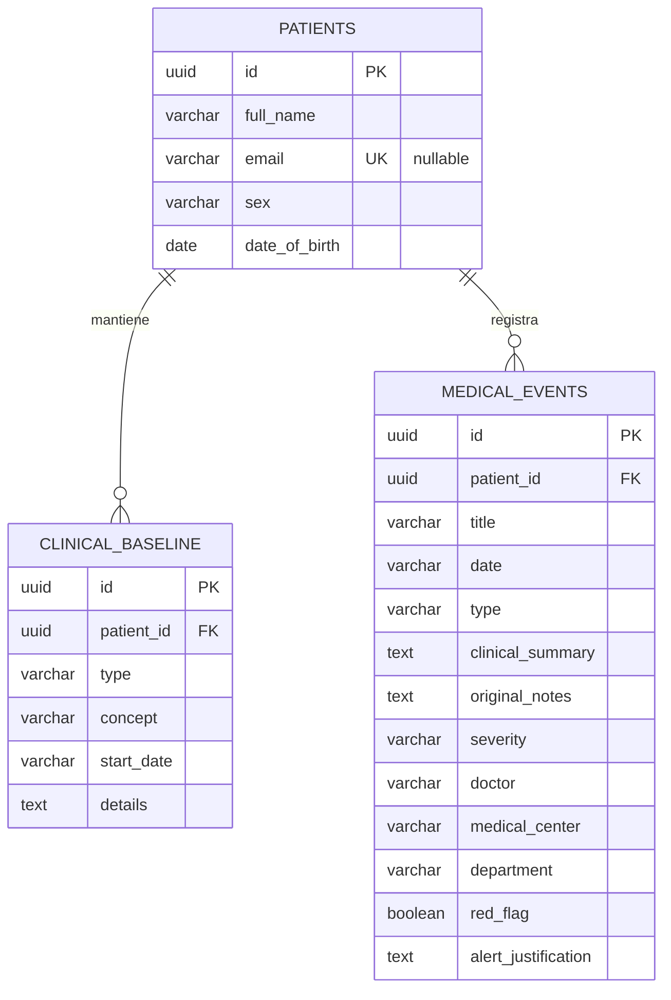

# AEnEA - Tu Pasaporte Médico Inteligente
**Historial Digital Clínico Longitudinal Aumentado por IA**

## 📌 Evidencias del proyecto en producción

* 🎥 [**Vídeo de demostración**](./evidences/video.mp4) — flujo completo de la app funcionando contra el backend real desplegado.
* 🖼️ [Swagger UI del backend en producción](./evidences/001.png) (`aenea-backend.onrender.com/docs`) — endpoints de `patients` y `health` documentados y operativos.
* 🖼️ [Historial de despliegues en Render](./evidences/002.png) — deploys en estado `live` disparados automáticamente por los commits de la rama `feature-entrega2-jiar`.
* 🖼️ [Builds de la app en EAS](./evidences/003.png) — build Android (`preview`) generado y distribuido vía Expo Application Services.

---

## Índice

0. [Ficha del proyecto](#0-ficha-del-proyecto)
1. [Descripción general del producto](#1-descripción-general-del-producto)
2. [Arquitectura del sistema](#2-arquitectura-del-sistema)
3. [Modelo de datos](#3-modelo-de-datos)
4. [Especificación de la API](#4-especificación-de-la-api)
5. [Historias de usuario](#5-historias-de-usuario)
6. [Tickets de trabajo](#6-tickets-de-trabajo)
7. [Pull requests](#7-pull-requests)

---

## 0. Ficha del proyecto

### **0.1. Tu nombre completo:**
José Ignacio Álvarez Ruiz

### **0.2. Nombre del proyecto:**
AEnEA - Tu Pasaporte Médico Inteligente

### **0.3. Descripción breve del proyecto:**
Plataforma de software médica de extremo a extremo que consolida el historial médico desestructurado de un paciente a través de voz y visión multimodal utilizando Modelos de Lenguaje (LLMs). Organiza de manera inteligente la información en una línea base clínica y un eje cronológico, mitigando activamente los sesgos de anclaje diagnóstico y permitiendo la exportación instantánea de un pasaporte de emergencia en PDF altamente legible.

### **0.4. URL del proyecto:**
* **Entorno de producción / Staging:** `https://aenea-passport-web.render.com` *(Entorno web mock/API Swagger)*
* **Acceso Seguro a Credenciales:** Compartido de manera confidencial vía OnetimeSecret a la coordinación académica.

### **0.5. URL o archivo comprimido del repositorio:**
* **Repositorio GitHub:** `https://github.com/jialvarez/AI4Devs-finalproject`

---

## 1. Descripción general del producto

### **1.1. Objetivo:**
El propósito fundamental de **AEnEA** es solucionar el problema de la fragmentación de la información de salud personal y neutralizar el **sesgo de anclaje diagnóstico** (la tendencia de los profesionales médicos a apoyarse en la primera información o síntoma obvio sin cruzar antecedentes críticos no evidentes). 

AEnEA aporta valor al paciente al actuar como un copiloto de recolección inteligente de datos longitudinales a lo largo de su vida. Permite centralizar informes clínicos, altas de urgencias, cirugías pasadas o síntomas vagos en una única interfaz unificada. El valor se rentabiliza en momentos críticos de emergencia o consultas en el extranjero, donde el paciente puede facilitar un documento de alta densidad clínica ("Pasaporte Médico") estructurado de forma inequívoca para evitar errores de diagnóstico que comprometan su vida.

### **1.2. Características y funcionalidades principales:**
* **Ingesta Multimodal Asíncrona:** El usuario puede registrar eventos médicos mediante notas de voz coloquiales de forma directa o fotografiando documentos físicos de salud (recetas, altas médicas, analíticas).
* **Estructuración y Enrutamiento Clínico Inteligente:** La IA procesa las entradas, aísla la paja administrativa y divide los datos en dos silos relacionales:
  * **Línea Base Clínica (Baseline):** Condiciones genéticas, dolencias crónicas (ej: Talasemia, ERGE) y medicación activa continuada (ej: Lansoprazol).
  * **Eje de Episodios (Timeline):** Hitos puntuales ordenados en el tiempo con aislamiento de metadatos (médicos, hospitales, departamentos, criticidad).
* **Motor Preventivo de Banderas Rojas (Longitudinal Flags):** Al introducir un síntoma actual común (ej: cefalea), la IA escanea el historial longitudinal completo y activa una bandera roja si el nuevo síntoma puede enmascarar una complicación crítica de un antecedente pasado (ej: una meningitis derivada de un colesteatoma previo).
* **Exportación del Pasaporte de Emergencia en Un Toque:** Generación instantánea en el dispositivo móvil de un documento PDF estructurado bajo estándares de diseño clínico de alta jerarquía, preparado para su compartición nativa inmediata.

### **1.3. Diseño y experiencia de usuario:**
> *(Nota: Enlaces a recursos multimedia y capturas de pantalla simuladas del flujo prioritario de la App móvil)*
* **Pantalla de Entrada (Línea de Vida):** Interfaz limpia que muestra en la zona superior el perfil crónico del usuario a través de *chips* interactivos (`[🩸 Talasemia Minor]`, `[💊 Lansoprazol (20mg)]`). Abajo se despliega un eje vertical (*timeline*) ordenado por fechas con tarjetas resumen de cada evento médico.
* **Flujo de Ingesta:** El usuario pulsa un botón flotante central de micrófono, dicta un suceso o sube la foto de una analítica. Una cortina de carga animada indica la extracción de entidades clínicas. La pantalla principal se refresca dinámicamente mostrando el hito guardado.
* **Flujo de Emergencia:** Un botón de acción rápida ('Exportar Pasaporte') renderiza el documento HTML, lo empaqueta en PDF y despliega el menú nativo para enviar por correo o guardar.
* **Recursos visuales adjuntos en el repositorio:** `[docs/assets/ux-timeline-view.png]`, `[docs/assets/ux-pdf-generation-flow.mp4]`.

### **1.4. Instrucciones de instalación:**

#### Requisitos Previos:
* Node.js v18 o superior & npm/yarn.
* Python 3.11 o superior.
* Docker & Docker Compose.
* OpenAI API Key válida (con saldo para llamadas a Whisper y GPT-4o-mini).

#### 1. Paso 1: Levantar la Infraestructura Local (Base de Datos)
```bash
cd backend
# Crear archivo de variables de entorno para la base de datos
cp .env.example .env
# Levantar el contenedor de PostgreSQL y Adminer
docker-compose up -d

```

#### 2. Paso 2: Instalación y Configuración del Backend (FastAPI)

```bash
cd backend
# Crear y activar entorno virtual
python -m venv venv
source venv/bin/activate  # En Windows: venv\Scripts\activate
# Instalar dependencias
pip install -r requirements.txt
# Ejecutar migraciones iniciales de la base de datos
alembic upgrade head
# Iniciar servidor de desarrollo (Swagger accesible en http://localhost:8000/docs)
uvicorn app.main:app --reload

```

#### 3. Paso 3: Instalación y Configuración del Frontend (React Native/Expo)

```bash
cd ../frontend
# Instalar dependencias de Node
npm install
# Iniciar la suite de Expo para simulación en iOS/Android
npx expo start

```

---

## 2. Arquitectura del Sistema

### **2.1. Diagrama de arquitectura:**

El sistema se rige bajo principios estrictos de **Clean Architecture**, aislando las reglas de negocio de la infraestructura y forzando el **Patrón Repository** bidireccional.



* **Justificación de Arquitectura:** Se selecciona **FastAPI** por su alto rendimiento asíncrono y su tipado nativo con Pydantic, idóneo para validar de forma robusta estructuras JSON médicas complejas. El desacoplamiento mediante interfaces/repositorios en el Frontend móvil y el Backend garantiza que el almacenamiento físico sea agnóstico (SQLite local en fase de test o PostgreSQL en AWS).
* **Beneficios:** Escalabilidad, robustez frente a caídas y facilidad para realizar mockings de las costosas llamadas a las APIs de IA en fases de tests.
* **Sacrificios/Déficits:** Mayor abstracción y código inicial de boilerplate debido al uso riguroso de interfaces y dtos en TypeScript y Python.

### **2.2. Descripción de componentes principales:**

* **Frontend Mobile (React Native + Expo):** Gestiona la interfaz del usuario, la grabación de streams de audio nativos con `expo-av` y la compilación dinámica de vistas HTML a PDF binario nativo con `expo-print`.
* **Backend REST (FastAPI):** Expone los contratos de la API. Centraliza el procesamiento asíncrono y realiza la validación de esquemas de datos clínicos.
* **AIOrchestratorService:** El "cerebro" del sistema. Coordina las peticiones a la API de OpenAI, enviando audios binarios al modelo Whisper para STT y payloads de imágenes o cadenas de texto estructuradas al modelo multimodal GPT-4o-mini Vision, forzando la salida en formatos JSON estrictos.
* **PostgreSQL Engine:** Base de datos relacional para garantizar la integridad referencial y las relaciones históricas complejas de los pacientes.

### **2.3. Descripción de alto nivel del proyecto y estructura de ficheros**

El proyecto adopta un formato limpio dividiendo las responsabilidades funcionales:

```text
├── backend/                  # Código fuente del Servidor Python
│   ├── app/
│   │   ├── api/v1/           # Controladores y rutas de la API (Endpoints)
│   │   ├── core/             # Configuraciones globales, seguridad y variables de entorno
│   │   ├── models/           # Definición de tablas físicas (SQLAlchemy ORM)
│   │   ├── repositories/     # Implementación del Patrón Repository (Acceso a Postgres)
│   │   ├── schemas/          # DTOs y validadores estrictos de datos (Pydantic)
│   │   └── services/         # Lógica de negocio (Orquestador de IA y parseador)
│   ├── migrations/           # Scripts de migración de base de datos con Alembic
│   └── docker-compose.yml    # Orquestación local de PostgreSQL y Adminer
├── frontend/                 # Código fuente de la Aplicación Móvil
│   ├── app/                  # Vistas de Expo Router (Timeline, Modales, Detalle)
│   ├── components/           # Elementos UI reutilizables (TimelineCard, BaselineChips)
│   ├── services/             # Abstracciones de repositorios y cliente HTTP en TS
│   └── types/                # Definición de tipos de datos clínicos de TypeScript
└── prompts.md                # Registro documentado del ciclo de vida con IA

```

### **2.4. Infraestructura y despliegue**

El despliegue del MVP se gestiona mediante arquitecturas PaaS en la nube de forma ágil:

* **Backend y Base de Datos:** Alojados de forma conjunta en **Render** (o Railway) mediante un despliegue continuo enlazado a la rama `main` de GitHub. Render levanta un contenedor Docker con la API de FastAPI y aprovisiona una base de datos PostgreSQL administrada.
* **Frontend:** Empaquetado y distribuido mediante **Expo EAS (Expo Application Services)**, generando compilaciones de prueba instalables directas por QR (modo Expo Go) o distribución en formato web estático de pruebas.

### **2.5. Seguridad**

* **Gestión Hermética de Secretos:** Todas las credenciales de base de datos, URLs de despliegue y la OpenAI API Key crítica se inyectan en tiempo de ejecución a través de variables de entorno del sistema (`.env`), estando explícitamente excluidas del repositorio mediante políticas de `.gitignore`.
* **Privacidad por Diseño (Privacy by Design):** Los eventos de la base de datos se disocian de datos personales identificativos mediante identificadores UUID v4 opacos.
* **Comunicaciones Cifradas:** Todo el tráfico transaccional móvil-servidor y servidor-OpenAI se fuerza obligatoriamente sobre el protocolo de cifrado **TLS/HTTPS**.

### **2.6. Tests**

La suite de pruebas automatizadas está diseñada para garantizar la resiliencia del flujo E2E:

* **Tests Unitarios (Pytest):** Validan de forma aislada que el `AIOrchestratorService` procese correctamente las cadenas JSON devueltas por la IA y que levante las excepciones adecuadas si la estructura viene corrupta o incompleta.
* **Tests de Integración:** Prueban los métodos de inserción y lectura del repositorio contra una instancia local aislada, asegurando la consistencia transaccional de las tablas relacionales.
* **Test E2E de Flujo:** Simulación automatizada en el backend donde se envía un archivo de audio real de prueba, verifica la correcta respuesta de Whisper, comprueba la creación física del registro en la base de datos y la correcta estructura del payload final listo para el PDF.

---

## 3. Modelo de Datos

### **3.1. Diagrama del modelo de datos:**

> **Nota (Entrega 2):** los nombres de atributo se documentan en inglés porque así se han
> implementado en el código (modelos SQLAlchemy, esquemas Pydantic y tipos TypeScript) — la
> convención adoptada en esta entrega es identificadores de código en inglés y contenido/prosa en
> español. Además, `email` pasa a ser opcional (el alta de paciente ya no lo pide) y se añaden los
> campos `sex` (US-00) y `title`/`red_flag`/`alert_justification` en `medical_events` (US-05).



### **3.2. Descripción de entidades principales:**

#### Entidad: `patients` (Pacientes)

* **`id`** (`UUID`, Primary Key): Identificador único global e inviolable del usuario.
* **`full_name`** (`VARCHAR(100)`, Not Null): Nombre completo del titular.
* **`email`** (`VARCHAR(100)`, Unique, Null): Correo electrónico opcional (el alta sin login de US-00 no lo solicita).
* **`sex`** (`VARCHAR(20)`, Not Null): Sexo declarado por el paciente en el alta (`'Hombre'`, `'Mujer'`, `'Otro'`).
* **`date_of_birth`** (`DATE`, Not Null): Fecha de nacimiento para el cálculo de variables de edad relativas a síntomas por la IA.

#### Entidad: `clinical_baseline` (Perfil Crónico / De Fondo)

* **`id`** (`UUID`, Primary Key): Identificador único del registro de fondo.
* **`patient_id`** (`UUID`, Foreign Key, Not Null): Enlace referencial con `patients.id` (`ON DELETE CASCADE`).
* **`type`** (`VARCHAR(50)`, Not Null): Discriminador de categoría (`'Condición Crónica'`, `'Tratamiento Prolongado'`, `'Alergia'`).
* **`concept`** (`VARCHAR(150)`, Not Null): Nombre clínico formal de la patología o fármaco (ej: "Talasemia Minor", "ERGE", "Lansoprazol").
* **`start_date`** (`VARCHAR(50)`, Null): Expresión temporal vaga o fija de inicio (ej: "Desde la infancia", "Hace 5 años").
* **`details`** (`TEXT`, Null): Dosificación, notas de gravedad o posología continuada.

#### Entidad: `medical_events` (Historial Temporal / Episodios)

* **`id`** (`UUID`, Primary Key): Identificador único del suceso.
* **`patient_id`** (`UUID`, Foreign Key, Not Null): Enlace referencial con `patients.id` (`ON DELETE CASCADE`).
* **`title`** (`VARCHAR(150)`, Not Null): Título corto y descriptivo del episodio (ej: "Cefalea Aguda Intensa y Síndrome Febril").
* **`date`** (`VARCHAR(50)`, Not Null): Fecha del suceso (ej: "2010", "2026-06-10").
* **`type`** (`VARCHAR(50)`, Not Null): Categoría del hito (`'Cirugía'`, `'Urgencias'`, `'Consulta'`, `'Analítica'`, `'Síntoma'`).
* **`clinical_summary`** (`TEXT`, Not Null): Síntesis de los hechos estructurada limpiamente por la IA.
* **`original_notes`** (`TEXT`, Null): Transcripción completa en bruto de Whisper o el texto sin procesar del OCR para auditorías visuales.
* **`severity`** (`VARCHAR(10)`, Not Null): Clasificación de riesgo determinada por el LLM (`'Alta'`, `'Media'`, `'Baja'`).
* **`doctor`** (`VARCHAR(100)`, Null): Facultativo firmante o tratante si consta en el informe.
* **`medical_center`** (`VARCHAR(100)`, Null): Hospital, centro de salud o clínica de ocurrencia.
* **`department`** (`VARCHAR(100)`, Null): Especialidad médica del evento (ej: Otorrinolaringología, Neurología, Urgencias).
* **`red_flag`** (`BOOLEAN`, Not Null, Default `false`): Activada por la IA cuando el evento, cruzado con el historial longitudinal, puede enmascarar una complicación crítica de un antecedente pasado (US-05).
* **`alert_justification`** (`TEXT`, Null): Explicación breve generada por la IA de por qué se activó `red_flag`.

---

## 4. Especificación de la API

> **Nota (Entrega 2):** al no existir login/autenticación (ver `US-00`), el paciente se identifica
> mediante `patient_id` como parámetro de ruta. Se añade el endpoint de alta `POST /api/v1/patients`
> (y su lectura `GET /api/v1/patients/{patient_id}`) y los tres endpoints originales pasan a colgar
> de `/api/v1/patients/{patient_id}/...`. Las claves JSON van en inglés (código); los valores de
> contenido clínico se mantienen en español. El campo `routing` admite un tercer valor,
> `IRRELEVANT`, para cuando la IA determina que el audio/imagen no contiene ninguna información
> clínica aprovechable (p.ej. el paciente pide una tortilla de patatas o dicta algo sin sentido) —
> en ese caso no se persiste nada en `clinical_baseline` ni `medical_events` y el endpoint responde
> `200 OK` (en lugar de `201 Created`) con `"status": "ignored"`.

A continuación se detallan los endpoints neurálgicos del backend documentados bajo la especificación formal de OpenAPI (Swagger):

```json
{
  "openapi": "3.0.0",
  "info": {
    "title": "AEnEA API - Motor de Pasaporte Médico",
    "version": "1.0.0"
  },
  "paths": {
    "/api/v1/patients": {
      "post": {
        "summary": "Registra un nuevo paciente (US-00, sin autenticación)",
        "description": "Recibe los datos básicos de identidad del paciente (nombre, sexo, fecha de nacimiento) recogidos en la pantalla de onboarding y crea su registro. El patient_id devuelto se persiste en el dispositivo móvil (AsyncStorage) y se usa como identificador en el resto de endpoints.",
        "requestBody": {
          "required": true,
          "content": {
            "application/json": {
              "schema": {
                "type": "object",
                "required": ["full_name", "sex", "date_of_birth"],
                "properties": {
                  "full_name": { "type": "string" },
                  "sex": { "type": "string", "enum": ["Hombre", "Mujer", "Otro"] },
                  "date_of_birth": { "type": "string", "format": "date" },
                  "email": { "type": "string", "nullable": true }
                }
              }
            }
          }
        },
        "responses": {
          "201": {
            "description": "Paciente creado correctamente.",
            "content": {
              "application/json": {
                "example": {
                  "id": "4a2b3c4d-5e6f-7a8b-9c0d-1e2f3a4b5c6d",
                  "full_name": "José Ignacio Álvarez Ruiz",
                  "sex": "Hombre",
                  "date_of_birth": "1990-01-01",
                  "email": null
                }
              }
            }
          }
        }
      }
    },
    "/api/v1/patients/{patient_id}": {
      "get": {
        "summary": "Recupera los datos de identidad de un paciente",
        "responses": {
          "200": { "description": "Paciente encontrado." },
          "404": { "description": "No existe un paciente con ese patient_id." }
        }
      }
    },
    "/api/v1/patients/{patient_id}/process-voice": {
      "post": {
        "summary": "Procesa ingesta de audio clínico",
        "description": "Recibe un archivo binario de voz, invoca de manera interna a Whisper para STT, estructura clínicamente los datos con un LLM (cruzándolos con el historial longitudinal del paciente para detectar red_flag) y los añade de forma automática al Timeline o Baseline del paciente.",
        "requestBody": {
          "required": true,
          "content": {
            "multipart/form-data": {
              "schema": {
                "type": "object",
                "properties": {
                  "file": {
                    "type": "string",
                    "format": "binary",
                    "description": "Archivo de audio grabado por el móvil (WAV, AAC, M4A)"
                  }
                }
              }
            }
          }
        },
        "responses": {
          "201": {
            "description": "Suceso clínico procesado y almacenado correctamente en base de datos.",
            "content": {
              "application/json": {
                "example": {
                  "status": "success",
                  "routing": "TIMELINE",
                  "data": {
                    "title": "Cefalea Aguda Intensa y Síndrome Febril",
                    "date": "2026-06-10",
                    "type": "Urgencias",
                    "clinical_summary": "El paciente presenta cefalea aguda intensa refractaria. Se activa alerta por riesgo neurológico cruzado.",
                    "severity": "Alta",
                    "red_flag": true,
                    "alert_justification": "Antecedente de colesteatoma requiere descartar meningitis."
                  }
                }
              }
            }
          },
          "200": {
            "description": "El contenido dictado no era clínicamente relevante; no se ha persistido nada.",
            "content": {
              "application/json": {
                "example": { "status": "ignored", "routing": "IRRELEVANT", "data": null }
              }
            }
          },
          "404": { "description": "No existe un paciente con ese patient_id." },
          "502": { "description": "Fallo del proveedor de IA o respuesta JSON inválida/incompleta." }
        }
      }
    },
    "/api/v1/patients/{patient_id}/process-document": {
      "post": {
        "summary": "Procesa imagen de informe clínico por Visión",
        "description": "Recibe una captura fotográfica en base64 de un informe, receta o analítica física, extrae la información relevante con un Vision LLM e impacta las tablas correspondientes.",
        "requestBody": {
          "required": true,
          "content": {
            "application/json": {
              "schema": {
                "type": "object",
                "required": ["image_base64"],
                "properties": {
                  "image_base64": {
                    "type": "string",
                    "description": "Cadena en formato base64 que representa el documento fotografiado."
                  }
                }
              }
            }
          }
        },
        "responses": {
          "201": {
            "description": "Documento médico analizado y estructurado.",
            "content": {
              "application/json": {
                "example": {
                  "status": "success",
                  "routing": "BASELINE",
                  "data": {
                    "type": "Tratamiento Prolongado",
                    "concept": "Lansoprazol 20mg",
                    "details": "Uso continuo diario prescrito en ayunas para control de ERGE."
                  }
                }
              }
            }
          },
          "200": {
            "description": "El documento fotografiado no era clínicamente relevante; no se ha persistido nada.",
            "content": {
              "application/json": {
                "example": { "status": "ignored", "routing": "IRRELEVANT", "data": null }
              }
            }
          },
          "404": { "description": "No existe un paciente con ese patient_id." },
          "422": { "description": "image_base64 no es una cadena base64 válida." }
        }
      }
    },
    "/api/v1/patients/{patient_id}/passport": {
      "get": {
        "summary": "Recupera el expediente médico longitudinal completo",
        "description": "Extrae de forma consolidada todos los registros de la línea base y los eventos cronológicos del paciente, listos para la maquetación del pasaporte en PDF.",
        "responses": {
          "200": {
            "description": "Expediente completo recuperado de forma exitosa.",
            "content": {
              "application/json": {
                "example": {
                  "patient_id": "4a2b3c4d-5e6f-7a8b-9c0d-1e2f3a4b5c6d",
                  "baseline": [
                    { "type": "Condición Crónica", "concept": "Talasemia Minor", "start_date": "Infancia" },
                    { "type": "Condición Crónica", "concept": "ERGE", "start_date": "Hace varios años" }
                  ],
                  "timeline": [
                    { "title": "Mastoidectomía por Colesteatoma", "date": "2010", "type": "Cirugía", "clinical_summary": "Mastoidectomía por colesteatoma izquierdo.", "medical_center": "Complejo Hospitalario", "red_flag": false },
                    { "title": "Cefalea Aguda Intensa y Síndrome Febril", "date": "2026-06-10", "type": "Urgencias", "clinical_summary": "Cefalea intensa y fiebre.", "doctor": "Dr. Torres", "red_flag": true, "alert_justification": "Antecedente de colesteatoma requiere descartar meningitis." }
                  ]
                }
              }
            }
          },
          "404": { "description": "No existe un paciente con ese patient_id." }
        }
      }
    }
  }
}

```

---

## 5. Historias de Usuario

A continuación se detallan las 6 historias de usuario que componen el alcance del MVP, clasificadas bajo la metodología MoSCoW para asegurar el cumplimiento del flujo prioritario de extremo a extremo (E2E). La `US-00` se incorpora en la Entrega 2 al detectarse que faltaba un paso previo imprescindible: sin saber quién es el paciente, la IA no tiene a quién atribuir el historial dictado.

### **Historia de Usuario 0 (Must-Have)**
* **ID:** `US-00`
* **Título:** Registro Inicial de Identidad del Paciente sin Autenticación.
* **Enunciado:** Como nuevo usuario de AEnEA, quiero indicar quién soy (nombre completo, sexo y fecha de nacimiento) la primera vez que abro la aplicación, para que el sistema pueda asociar mi historial médico a mi perfil sin necesidad de crear una contraseña ni iniciar sesión.
* **Criterios de Aceptación:**
  * **Dado** que el usuario abre la aplicación por primera vez (no existe `patient_id` guardado en el dispositivo):
  * **Cuando** rellena el formulario de nombre completo, sexo y fecha de nacimiento y pulsa "Continuar",
  * **Entonces** la aplicación debe invocar `POST /api/v1/patients`, persistir el `patient_id` devuelto en el almacenamiento local del dispositivo (AsyncStorage) y navegar a la pantalla principal (Timeline).
  * **Dado** que el usuario ya completó el registro en una sesión anterior:
  * **Cuando** vuelve a abrir la aplicación,
  * **Entonces** debe omitirse el formulario de onboarding y navegar directamente a la pantalla principal, sin pedirle sus datos de nuevo.

### **Historia de Usuario 1 (Must-Have)**
* **ID:** `US-01`
* **Título:** Ingesta y Estructuración de Hitos Clínicos mediante Dictado por Voz.
* **Enunciado:** Como Paciente de AEnEA, quiero dictar de viva voz un síntoma, intervención o antecedente médico en mi aplicación móvil, para que el sistema extraiga la información clínica relevante de forma estructurada y cronológica sin tener que rellenar formularios manuales complejos.
* **Criterios de Aceptación:**
  * **Dado** que el usuario presiona el botón flotante de micrófono en la pantalla principal de la App móvil:
  * **Cuando** habla y suelta el botón para finalizar la grabación de audio,
  * **Entonces** el sistema debe capturar el archivo nativo local, enviarlo mediante `FormData` al endpoint de FastAPI, procesar la transcripción exacta con la API de Whisper de OpenAI y añadir el suceso estructurado en la base de datos de forma automática.

### **Historia de Usuario 2 (Must-Have)**
* **ID:** `US-02`
* **Título:** Extracción de Entidades Médicas mediante Fotografías de Documentos Físicos.
* **Enunciado:** Como Paciente de AEnEA, quiero tomar una foto o cargar una imagen de un informe de alta médica, analítica o receta en papel, para que la IA extraiga los metadatos clínicos estructurados de manera automatizada.
* **Criterios de Aceptación:**
  * **Dado** que el usuario selecciona la opción 'Subir informe' y habilita los permisos de la cámara:
  * **Cuando** toma una foto nítida de un informe médico firmado,
  * **Entonces** el backend debe procesar la imagen mediante el modelo multimodal `gpt-4o-mini`, aislar los encabezados administrativos innecesarios, extraer el diagnóstico principal, el centro médico y los doctores firmantes, guardándolos en base de datos.

### **Historia de Usuario 3 (Must-Have)**
* **ID:** `US-03`
* **Título:** Clasificación y Enrutamiento Inteligente del Perfil Clínico.
* **Enunciado:** Como Paciente de AEnEA, quiero que la IA discrimine automáticamente si mi información médica pertenece a mi línea base crónica o a un evento temporal aislado, para mantener mi historial perfectamente organizado sin intervención manual.
* **Criterios de Aceptación:**
  * **Dado** que la IA recibe un texto procesado (por voz o imagen):
  * **Cuando** el contenido describa una patología de fondo, rasgo genético o medicación permanente (ej: Talasemia, ERGE, Lansoprazol), **Entonces** debe registrarlo en la tabla `clinical_baseline` y actualizar los chips de la cabecera.
  * **Cuando** el contenido describa un hecho puntual en el tiempo (ej: visita a Urgencias o Cirugía), **Entonces** debe registrarlo en la tabla `medical_events` y renderizarlo en el eje cronológico.

### **Historia de Usuario 4 (Must-Have)**
* **ID:** `US-04`
* **Título:** Exportación de Pasaporte Clínico de Emergencia a formato PDF.
* **Enunciado:** Como Paciente en una situación de urgencia o en un centro hospitalario extranjero, quiero exportar mi historial consolidado a un archivo PDF maquetado profesionalmente con un solo toque, para facilitar mi contexto vital completo a un médico de urgencias de forma inmediata.
* **Criterios de Aceptación:**
  * **Dado** que el usuario se encuentra en la pantalla principal de la aplicación móvil:
  * **Cuando** presiona el botón 'Exportar Pasaporte',
  * **Entonces** la aplicación debe invocar las librerías nativas `expo-print` y `expo-sharing`, maquetar la cabecera fija y los episodios cronológicos en un diseño HTML de alta fidelidad, y abrir la hoja nativa del sistema operativo para guardar o enviar el PDF de forma inmediata.

### **Historia de Usuario 5 (Should-Have - Opcional)**
* **ID:** `US-05`
* **Título:** Sistema de Alertas por Banderas Rojas Clínicas Cruzadas (Longitudinal Flags).
* **Enunciado:** Como Paciente preventivo, quiero que el sistema me alerte visualmente si un síntoma actual agudo se cruza peligrosamente con un antecedente crítico de mi historial pasado, para prevenir sesgos de diagnóstico comunes.
* **Criterios de Aceptación:**
  * **Dado** que un paciente tiene registrado en su historial un antecedente de alto riesgo (ej: cirugía por colesteatoma):
  * **Cuando** registre un nuevo evento clínico de tipo síntoma con entradas como 'cefalea intensa' o 'fiebre',
  * **Entonces** la IA del backend debe activar el estado `bandera_roja: true` en el JSON y la aplicación móvil debe pintar un banner de advertencia crítico de color rojo en la interfaz y en la cabecera del PDF exportado.


---

## 6. Tickets de Trabajo

> **Nota:** los tickets `TCK-B-01`, `TCK-F-01` y `TCK-D-01` corresponden a la Entrega 1 y fueron
> puramente de diseño/documentación (no había código en el repositorio). Los tickets de la
> **Entrega 2** (`TCK-*-02`), al final de esta sección, son los que reflejan la implementación de
> código real: backend FastAPI funcional con tests en verde, frontend Expo compilable y
> configuración de despliegue.

#### **Ticket 1: [BACKEND] - Endpoint y Lógica de Orquestación del Servicio de IA**

* **ID:** `TCK-B-01`
* **Épica/US:** Vinculado a `US-01` y `US-03`
* **Prioridad:** Bloqueante / Alta
* **Descripción Técnica de la Tarea:** Desarrollar en el backend de FastAPI la ruta `/api/v1/health/process-voice` que acepte archivos binarios mediante `UploadFile`. La tarea requiere codificar la lógica interna del servicio `AIOrchestratorService` para invocar la API oficial de OpenAI Whisper utilizando la librería nativa de OpenAI en Python. El texto transcrito resultante debe ser inyectado en un segundo prompt del sistema diseñado de forma restrictiva con Pydantic y `response_format={"type": "json_object"}` para forzar una salida JSON estricta y limpia que contenga la discriminación de ruta de destino (Timeline vs Baseline) y las entidades clínicas completamente estructuradas.
* **Criterios de Aceptación del Ticket:** El endpoint debe retornar un código de estado `201 Created`, un esquema JSON válido que cumpla con el modelo DTO diseñado, y estar completamente testeado de forma unitaria simulando respuestas válidas y corruptas del LLM externo.

#### **Ticket 2: [FRONTEND] - Pantalla de Línea de Vida (Timeline) e Integración de Componentes Nativos**

* **ID:** `TCK-F-01`
* **Épica/US:** Vinculado a `US-01` y `US-04`
* **Prioridad:** Alta
* **Descripción Técnica de la Tarea:** Construir la interfaz de usuario principal de AEnEA en React Native utilizando TypeScript y las convenciones de Expo Router. Desarrollar un componente de cabecera fija que renderice de forma horizontal las condiciones crónicas (`clinical_baseline`) usando componentes visuales de etiquetas de colores legibles. Debajo, implementar una `FlatList` vertical optimizada que actúe como un eje de línea de tiempo cronológico. Cada tarjeta debe ser interactiva y, al pulsarse, debe desplegar un componente Modal nativo o un *BottomSheet* que pinte ordenadamente los metadatos de segundo nivel (Doctores, centros médicos, notas originales completas procesadas por la IA).
* **Criterios de Aceptación del Ticket:** La interfaz debe ser fluida, no bloquear el hilo de ejecución principal del teléfono al actualizar estados y presentar un diseño limpio, minimalista y adaptado a guías de accesibilidad médica (alto contraste y fuentes legibles).

#### **Ticket 3: [DATABASE] - Modelado Físico y Capa de Persistencia Relacional**

* **ID:** `TCK-D-01`
* **Épica/US:** Vinculado a `US-03`
* **Prioridad:** Crítica / Inicial
* **Descripción Técnica de la Tarea:** Definir e implementar el esquema físico de datos relacionales en PostgreSQL utilizando el ORM **SQLAlchemy** en el backend. Crear los modelos de clases de Python mapeando con exactitud las tres tablas core del MVP: `patients`, `clinical_baseline` y `medical_events`. Configurar de forma manual las restricciones estructurales: claves primarias de tipo UUID generadas de forma automática en servidor, claves foráneas indexadas para agilizar las búsquedas longitudinales, obligatoriedad de campos mediante restricciones `nullable=False`, y políticas de borrado en cascada `ondelete="CASCADE"` para evitar la orfandad de registros médicos sensibles.
* **Criterios de Aceptación del Ticket:** Generar el archivo de migración inicial mediante la herramienta **Alembic**, verificar que la base de datos PostgreSQL local en Docker compile y cree el esquema físico de tablas relacionales sin errores de tipado o de sintaxis SQL.

### Entrega 2 — Implementación de Código

#### **Ticket 4: [BACKEND] - Onboarding sin Autenticación y Migración de Esquema Ampliado**

* **ID:** `TCK-B-02`
* **Épica/US:** Vinculado a `US-00`
* **Prioridad:** Bloqueante / Alta
* **Descripción Técnica de la Tarea:** Añadir el campo `sex` a `patients` (con `email` ahora nullable) y los campos `title`, `red_flag`, `alert_justification` a `medical_events`; generar y aplicar la migración de Alembic correspondiente. Implementar `POST /api/v1/patients` y `GET /api/v1/patients/{patient_id}`, y migrar `process-voice`, `process-document` y `passport` a colgar de `/api/v1/patients/{patient_id}/...` ya que no existe sesión/token que identifique al paciente.
* **Criterios de Aceptación del Ticket:** `alembic upgrade head` aplica limpiamente contra Postgres; los tests de integración de repositorio y de API pasan en verde; el `patient_id` devuelto en el alta permite recuperar el passport correcto.

#### **Ticket 5: [BACKEND] - AIOrchestratorService Real con Detección de Banderas Rojas**

* **ID:** `TCK-B-03`
* **Épica/US:** Vinculado a `US-01`, `US-02`, `US-03` y `US-05`
* **Prioridad:** Alta
* **Descripción Técnica de la Tarea:** Implementar `AIOrchestratorService` con un cliente OpenAI inyectable (`IOpenAIClient`) para desacoplar la lógica de negocio del SDK real, permitiendo tests unitarios con un doble de prueba (`FakeOpenAIClient`) sin tocar la red. El prompt del sistema inyecta un resumen textual del historial longitudinal del paciente para que el LLM pueda activar `red_flag`/`alert_justification` cuando corresponda (ver ejemplo del colesteatoma/meningitis en la Sección 1.2).
* **Criterios de Aceptación del Ticket:** Tests unitarios cubren JSON válido (BASELINE y TIMELINE), JSON corrupto, JSON incompleto y errores de red del proveedor, todos mapeados a las excepciones (`AIResponseParsingError`, `AIProviderError`) y códigos HTTP (`502`) correctos. Un test E2E opcional (activo solo si hay `OPENAI_API_KEY`) verifica el flujo real contra Whisper con un audio de prueba.

#### **Ticket 6: [FRONTEND] - Onboarding, Ingesta y Exportación PDF Funcionales**

* **ID:** `TCK-F-02`
* **Épica/US:** Vinculado a `US-00`, `US-01`, `US-02`, `US-04` y `US-05`
* **Prioridad:** Alta
* **Descripción Técnica de la Tarea:** Construir la app Expo Router completa: pantalla de onboarding (US-00) que persiste `patient_id` en `AsyncStorage`; pantalla de Timeline con cabecera de chips de baseline, banner de bandera roja, tarjetas de eventos y modal de detalle; grabación de voz con `expo-audio` y subida de fotos con `expo-image-picker`; exportación del pasaporte a PDF con `expo-print`/`expo-sharing` replicando el diseño del PDF de muestra del repositorio.
* **Criterios de Aceptación del Ticket:** `npx tsc --noEmit` sin errores; `npx expo export` bundlea sin fallos; el flujo completo (onboarding → dictar nota → ver evento → exportar PDF) funciona contra el backend local.

#### **Ticket 7: [DEVOPS] - Configuración de Despliegue (Render + Expo EAS)**

* **ID:** `TCK-D-02`
* **Épica/US:** Transversal (Sección 2.4)
* **Prioridad:** Media
* **Descripción Técnica de la Tarea:** Preparar `backend/Dockerfile`, `render.yaml` (Blueprint con servicio web Docker + Postgres gestionado) y `frontend/eas.json` (perfiles development/preview/production), junto con un documento de handoff (`DEPLOY.md`) con los comandos exactos de `render login`/`eas login`/`eas build` para que el autor del proyecto despliegue con sus propias credenciales.
* **Criterios de Aceptación del Ticket:** El Blueprint de Render es válido sintácticamente y referencia correctamente el Dockerfile; `eas.json` valida contra el esquema de EAS CLI; `DEPLOY.md` no requiere que ningún asistente de IA tenga acceso a credenciales de terceros.

---

## 7. Pull Requests

> **Nota:** las PRs `#01`-`#03` corresponden a la Entrega 1 (documentación/diseño, sin código en el
> repositorio). Las PRs `#04`-`#06` de la **Entrega 2** son las que introducen el código real del
> backend, frontend y configuración de despliegue sobre la rama `feature-entrega2-jiar`.

#### **Pull Request 1: [INFRA & DB] Setup Inicial de la Capa de Datos Relacional**

* **ID de PR:** `PR #01`
* **Rama Origen:** `feature-entrega1-jiar/infra-db-setup`
* **Descripción de Cambios:** Esta PR establece la cimentación técnica inicial del backend de AEnEA. Introduce la configuración del monorepo, los archivos de Docker Compose para levantar PostgreSQL y Adminer en el entorno local, la inicialización del motor ORM de SQLAlchemy y los scripts de migración de datos con Alembic de las tablas de Pacientes, Eventos Médicos y Línea Base Clínica. Incluye los ficheros de tipados de TypeScript correspondientes en el directorio del cliente móvil.
* **Trazabilidad:** Resuelve por completo el ticket de base de datos `TCK-D-01`.

#### **Pull Request 2: [BACKEND] Orquestación de IA y Contratos de Entrada de Datos**

* **ID de PR:** `PR #02`
* **Rama Origen:** `feature-entrega1-jiar/backend-ai-orchestration`
* **Descripción de Cambios:** Implementa el núcleo lógico inteligente del backend de la plataforma. Añade las rutas de la API en FastAPI para la gestión de procesamiento de audio y visión multimodal. Incorpora de forma íntegra la lógica del componente `AIOrchestratorService` acoplado de forma limpia al SDK de OpenAI, configurando de manera segura el uso de prompts del sistema estrictos con Structured Outputs. Forzar la validación de entrada/salida de datos de cara al cliente mediante esquemas de Pydantic v2.
* **Trazabilidad:** Cierra el ticket de desarrollo técnico backend `TCK-B-01`.

#### **Pull Request 3: [FRONTEND] Interfaz de Eje Cronológico y Módulo de Exportación PDF**

* **ID de PR:** `PR #03`
* **Rama Origen:** `feature-entrega1-jiar/frontend-timeline-pdf`
* **Descripción de Cambios:** Culmina el MVP de extremo a extremo en la capa cliente. Desarrollar los componentes visuales interactivos de React Native para pintar las tarjetas de hitos y la cabecera fija de perfil de salud crónico. Integra las librerías nativas de Expo `expo-print` y `expo-sharing` inyectando la maquetación HTML de alta fidelidad clínica para permitir la generación del archivo del Pasaporte Médico de Emergencia local compartible con un solo toque.
* **Trazabilidad:** Completa con éxito el ticket frontend `TCK-F-01` y consolida el Happy Path prioritario del producto AEnEA.

### Entrega 2 — Implementación de Código

#### **Pull Request 4: [BACKEND] Onboarding sin Autenticación, Esquema Ampliado y AIOrchestratorService Real**

* **ID de PR:** `PR #04`
* **Rama Origen:** `feature-entrega2-jiar`
* **Descripción de Cambios:** Implementa por primera vez el backend real de AEnEA en FastAPI: modelos SQLAlchemy (`Patient` con `sex`, `ClinicalBaseline`, `MedicalEvent` con `title`/`red_flag`/`alert_justification`) con tipo `GUID` agnóstico de Postgres/SQLite, migración inicial de Alembic aplicada contra Postgres en Docker, capa de repositorio (`IHealthRepository`/`SQLAlchemyHealthRepository`), `AIOrchestratorService` con cliente OpenAI inyectable y detección de banderas rojas, y los endpoints `POST /api/v1/patients`, `GET /api/v1/patients/{patient_id}`, `process-voice`, `process-document` y `passport`. Incluye batería de tests (unitarios, integración y E2E opcional) en verde.
* **Trazabilidad:** Resuelve `TCK-B-02` y `TCK-B-03`.

#### **Pull Request 5: [FRONTEND] App Expo Router: Onboarding, Timeline, Ingesta y Exportación PDF**

* **ID de PR:** `PR #05`
* **Rama Origen:** `feature-entrega2-jiar`
* **Descripción de Cambios:** Construye la app móvil real con Expo Router y TypeScript: pantalla de onboarding (US-00) con persistencia de `patient_id` en `AsyncStorage`, pantalla de Timeline con cabecera de baseline, banner de bandera roja, tarjetas de eventos y modal de detalle, grabación de voz (`expo-audio`) y captura de documentos (`expo-image-picker`), y exportación del pasaporte a PDF (`expo-print`/`expo-sharing`) fiel al diseño de `pasaporte_medico_inteligente.pdf`. Verificado con `tsc --noEmit` y `expo export` sin errores.
* **Trazabilidad:** Resuelve `TCK-F-02`.

#### **Pull Request 6: [DEVOPS] Configuración de Despliegue en Render + Expo EAS**

* **ID de PR:** `PR #06`
* **Rama Origen:** `feature-entrega2-jiar`
* **Descripción de Cambios:** Añade `backend/Dockerfile`, `render.yaml` (Blueprint de servicio web + Postgres gestionado) y `frontend/eas.json`, junto con `DEPLOY.md` documentando los pasos exactos de `render login`/`eas login`/`eas build` para que el propio autor despliegue con sus credenciales, sin que estas transiten por ningún asistente de IA.
* **Trazabilidad:** Resuelve `TCK-D-02`.
